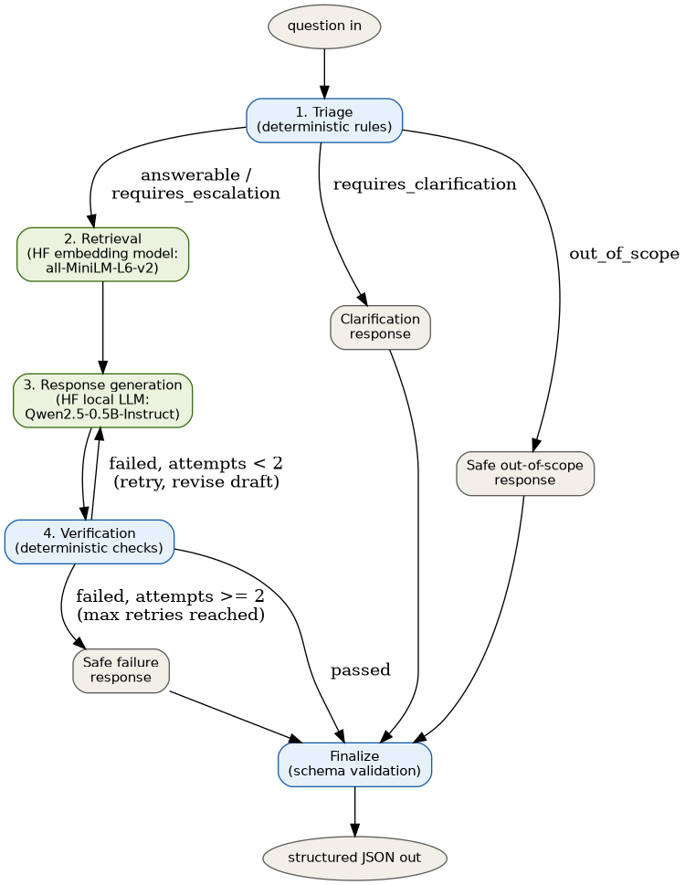

# OrbitDesk Support Agent Network

A local-first, graph-orchestrated support agent for the fictional OrbitDesk
product, built for the AI Engineer Internship assignment. Triage, retrieval,
generation and verification are implemented as LangGraph nodes over shared
typed state, with a bounded retry loop and safe-failure fallback.

> **Note on repo layout:** all project files (code, data, tests, the graph
> diagram, and the detailed README) live inside the `orbitdesk-agent/`
> subfolder of this repository, not at the repo root. `cd orbitdesk-agent`
> first, then follow the instructions below -- they all assume you're
> inside that folder.

## AI-assistant disclosure

I used an AI coding assistant (Claude) while building this project. It helped
scaffold the LangGraph node/graph structure, the pydantic schema, the
regex-based triage/verification rule sets, the pytest routing tests, and the
README. I designed the overall architecture (triage → retrieval → generation
→ verification → finalize, with the retry/safe-failure branches), wrote and
reviewed the prompts and rules, ran and read every test, and can explain or
modify any part of this implementation.

## Architecture



Full details -- the node-by-node table, model names/revisions, hardware and
timing numbers from my own run, setup, testing, and design trade-offs -- are
in [`orbitdesk-agent/README.md`](orbitdesk-agent/README.md).

## Quick setup

```bash
cd orbitdesk-agent
python -m venv .venv
.venv\Scripts\activate          # Windows PowerShell
# source .venv/bin/activate     # macOS/Linux

pip install -r requirements.txt
python cli.py --sample          # first run downloads the two HF models
```

Fast, offline sanity check of just the routing logic (no downloads):

```bash
cd orbitdesk-agent
pip install langgraph pydantic numpy pytest
python cli.py --sample --mock
pytest -q
```

See [`orbitdesk-agent/README.md`](orbitdesk-agent/README.md) for the full
writeup, including exact model names/revisions, hardware used, latency
numbers, the graph diagram, the automated test descriptions, and known
limitations.
